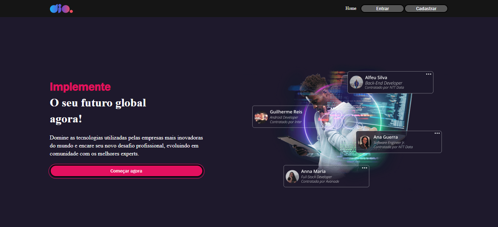
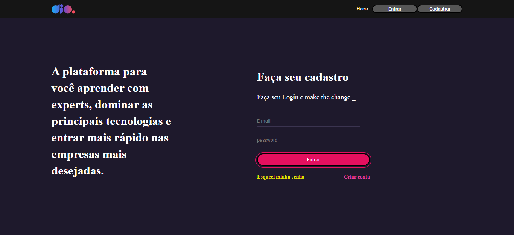
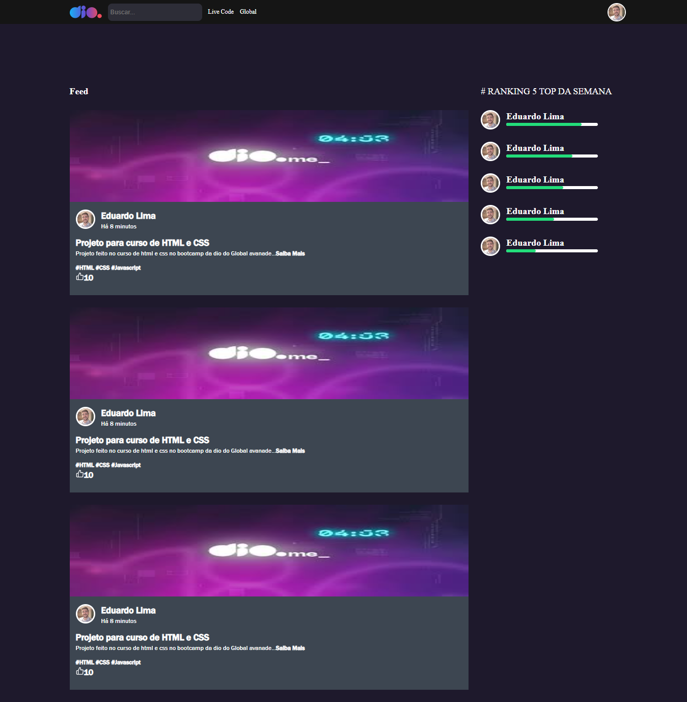

<h1 align="center"> Clone do site da DIO </h1>

Aula do Bootcamp exclusivo e gratuito, promovido pela DIO para ensino de tecnologias WEB.

  <a href="#-tecnologias">Tecnologias</a>&nbsp;&nbsp;&nbsp;|&nbsp;&nbsp;&nbsp;
  <a href="#-projeto">Projeto</a>&nbsp;&nbsp;&nbsp;|&nbsp;&nbsp;&nbsp;
 <a href="#memo-licença">Licença</a>

  

 

  
  
  

## 🚀 Tecnologias

Esse projeto foi desenvolvido com as seguintes tecnologias:

- HTML e CSS
- JavaScript - DOM
- React 
- Styled-components
- React-router-dom
- Yarn - npm
- Git e Github

## 💻 Projeto

Um clone do site da DIO.

## :memo: Licença

Esse projeto está sob a licença MIT.

---

Feito com ♥ by DIO